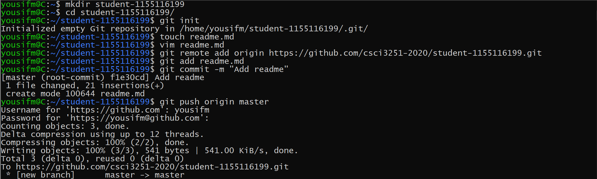

#I am Yousif Alebyary. Here are my interests:
* Web Development
* Mobile Development
* UI/UX Design

| Course Name                         | Course Code |
|-------------------------------------|-------------|
| Engineering Practicum               | CSCI3251    |
| Computers and Society               | CSCI3250    |
| Software Engineering                | CSCI3100    |
| Probability and Statistics          | ENGG2430    |
| English for Engineering Students II | ELTU3014    |
| Web Applications                    | CSCI2720    |

### Things I need to work on

- [x] **CSCI 2720** Assignment 4
- [ ] **CSCI 3251** Course Project
- [ ] **CSCI 3250** Visit Report
- [x] **CSCI 3251** Workshop 5

